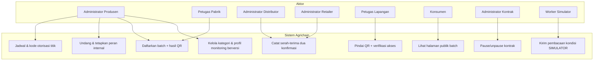
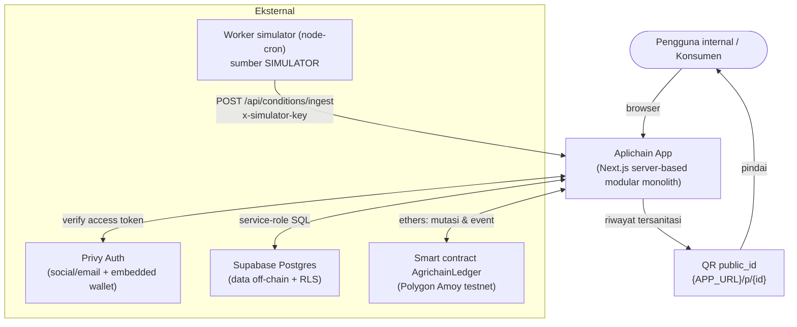
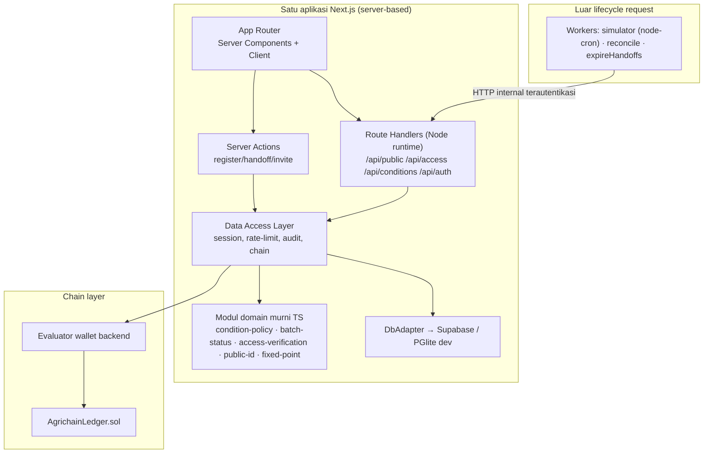
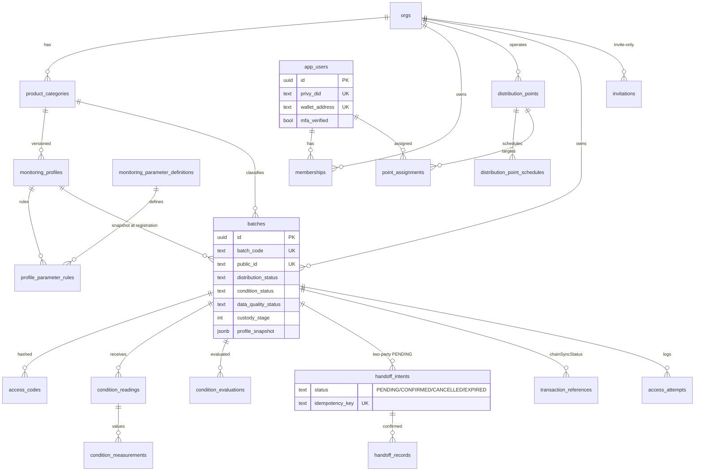
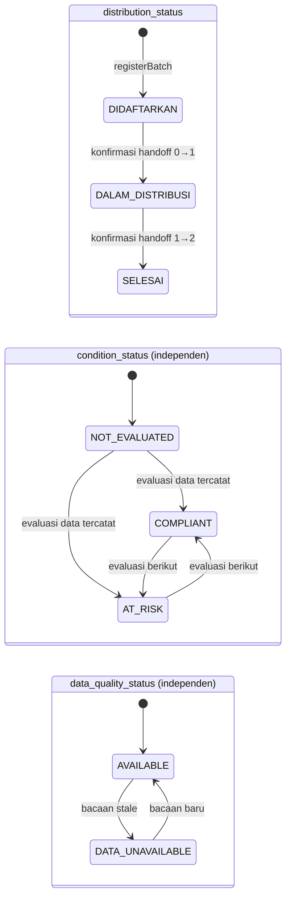
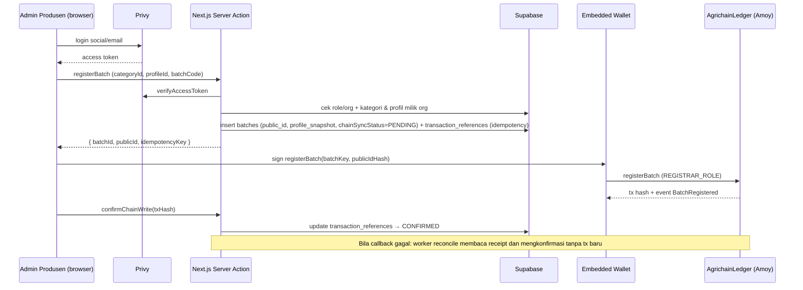
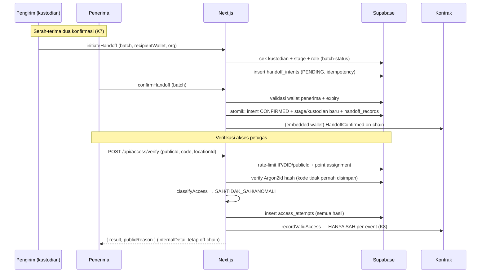
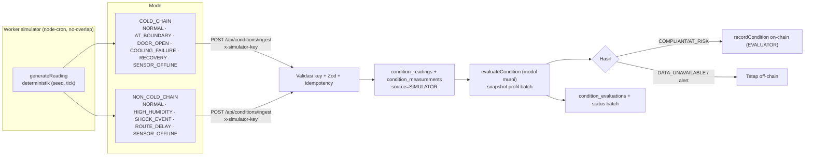
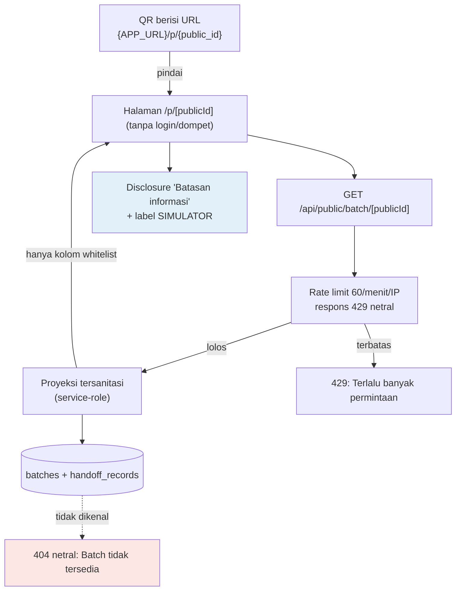
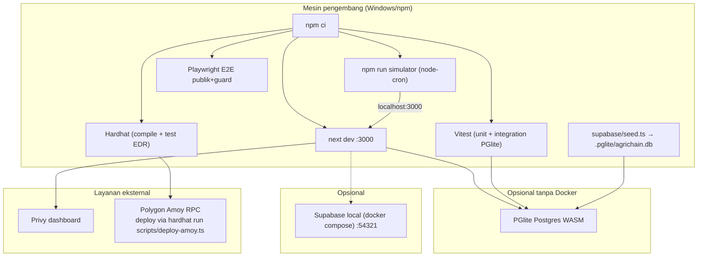

# Diagram Sistem Agrichain (Sumber Mermaid)

> Dirender ke PNG/SVG via mermaid-cli: `npx -y @mermaid-js/mermaid-cli -i docs/diagrams/XX-*.mmd -o docs/diagrams/rendered/`
> Status pada diagram merepresentasikan evaluasi atas data kondisi tercatat — bukan bukti keamanan pangan fisik.

## 01 — Use Case Diagram

## 02 — System Context Diagram

## 03 — Diagram Arsitektur Modular Monolith

## 04 — ERD Off-chain (ringkas)

## 05 — State Machine Batch

## 06 — Sequence Pendaftaran Batch

## 07 — Sequence Serah-terima & Verifikasi Akses

## 08 — Alur Simulator & Evaluasi Kondisi

## 09 — Alur Data QR Publik

## 10 — Lingkungan Lokal & Testnet

